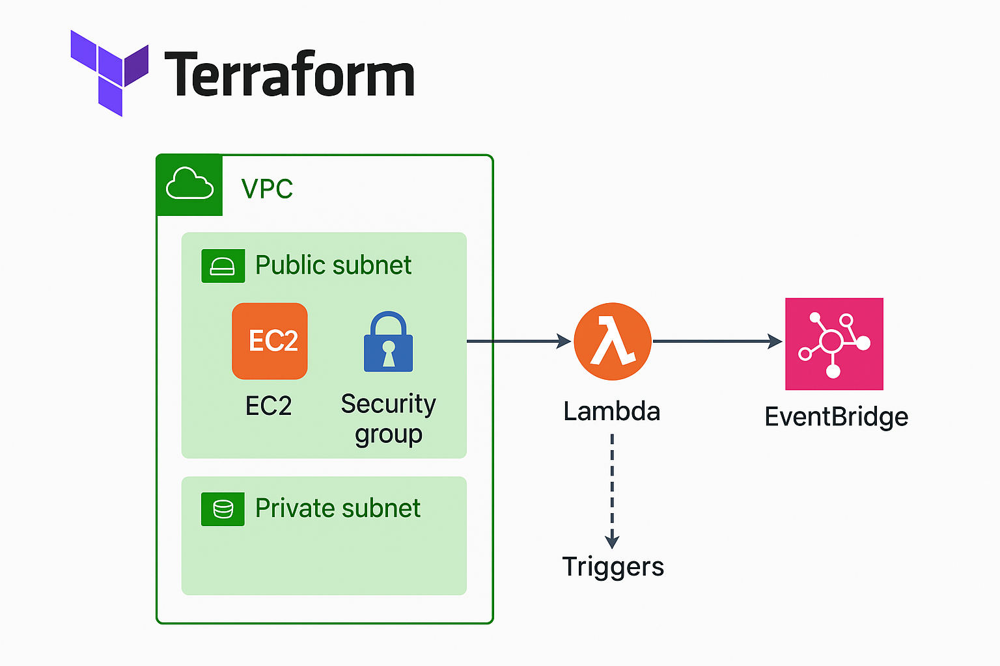

# ec2-scheduler-cost-optimizer
Automated AWS EC2 start/stop scheduling with Terraform and Lambda to reduce cloud costs. Includes pre-deployment cost estimation via Infracost and flexible cron-based scheduling.

# Overview
This project provisions an AWS EC2 instance that automatically starts and stops on a defined schedule to save costs, while still preserving EBS storage.
The automation is implemented using AWS Lambda triggered by EventBridge rules, all managed with Terraform.
Additionally, Infracost integration estimates the cost before deployment.

# Architecture
1. EC2 Instance: Amazon Linux 2 with persistent EBS root volume.
2. Lambda Functions:
    - start_ec2.py — Starts the instance.
    - stop_ec2.py — Stops the instance.
3. EventBridge (CloudWatch) Rules:
    - Start rule (e.g., 7 AM weekdays).
    - Stop rule (e.g., 11 PM weekdays).
4. IAM Role: Grants Lambda EC2 control & CloudWatch logging.
5. Security Groups: Restricts SSH access to your IP, allows HTTP optionally.
6. Infracost: Estimates cost before terraform apply.



# File Structure
```
.
├── ec2.tf                         # EC2 instance & AMI data
├── lambda.tf                      # Lambda packaging, IAM roles, functions
├── scheduler.tf                   # EventBridge rules, targets, Lambda permissions
├── security.tf                    # Security groups for EC2 (and optionally Lambda)
├── variables.tf                   # Configurable variables (region, instance type, cron, etc.)
├── outputs.tf                     # Outputs for important resources & schedules
├── provider.tf                    # AWS provider configuration
├── lambda_src/
│   ├── start_ec2.py
│   ├── stop_ec2.py
│   └── test_lambda_functions.py
├── Makefile                       # Terraform + Infracost commands
├── jenkinsfile
└── README.md
```
# Process Flow

1. Terraform provisions EC2, Lambda, EventBridge, and IAM roles.
2. EventBridge Rules trigger Lambda functions at scheduled times.
3. Lambda Functions start/stop the EC2 instance.
4. EBS Volume Persistence ensures storage remains even if EC2 is stopped or restarted.
5. Infracost runs before terraform apply to show cost estimation.

# Pre-requisites

1. AWS CLI configured (aws configure)
2. Terraform installed
3. Infracost installed ([Install guide](https://www.infracost.io/docs/#quick-start))
4. Make installed (optional, for Makefile commands)

# Usage

1. Configure Variables
2. Run Cost Estimation & Deployment
Using the Makefile:
```
  make plan   # Terraform plan + Infracost breakdown
  make apply  # Apply infrastructure changes
```
# Outputs
After deployment, Terraform will output:
1. EC2 instance ID
2. Public IP
3. Start/Stop schedule cron expressions

# Cost Optimization Notes
1. Stopping EC2 halts compute billing but EBS volumes are still billed.
2. delete_on_termination = false can be set in root_block_device to keep storage even after termination (currently commented in ec2.tf).
3. EC2 free tier covers 750 hours/month for t2.micro/t3.micro in the first 12 months.

# Security
1. EC2 security group allows SSH only from your IP.
2. Optional HTTP access enabled in security.tf.
